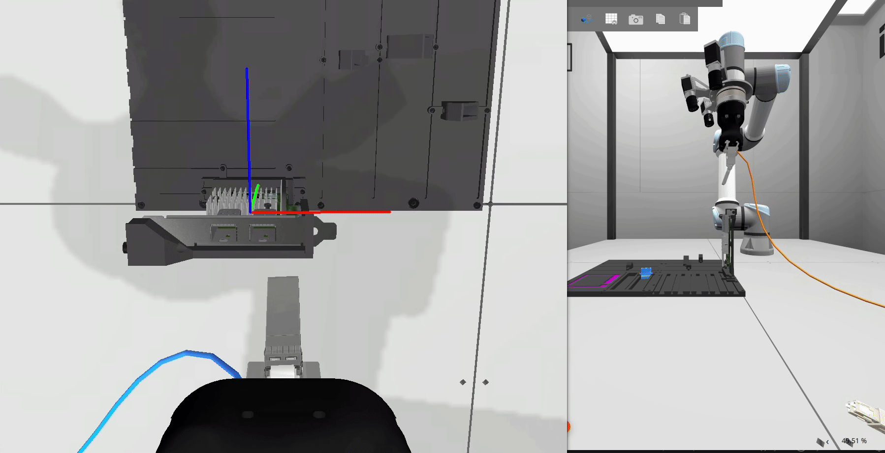
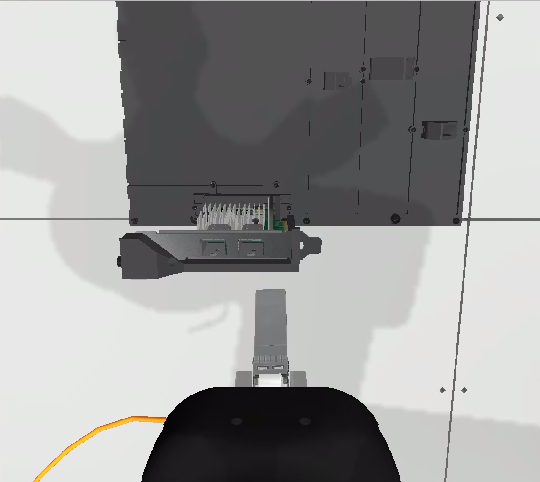
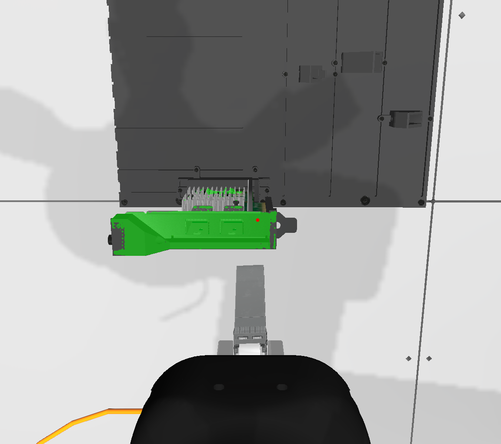
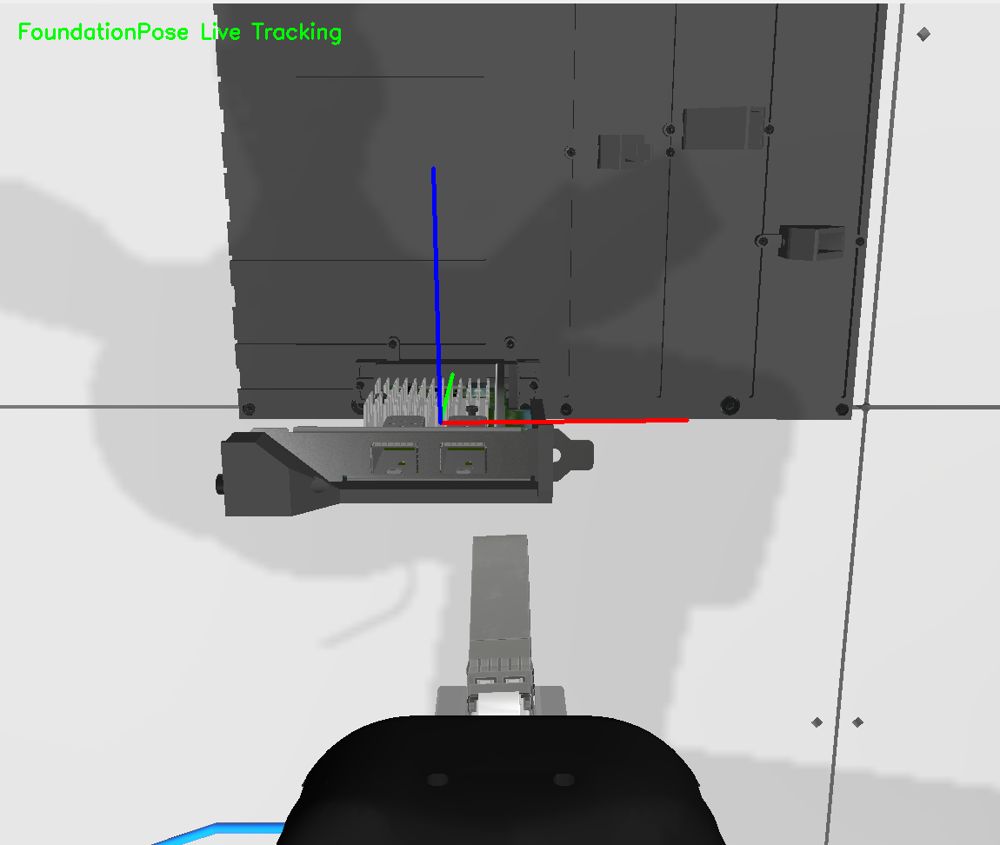
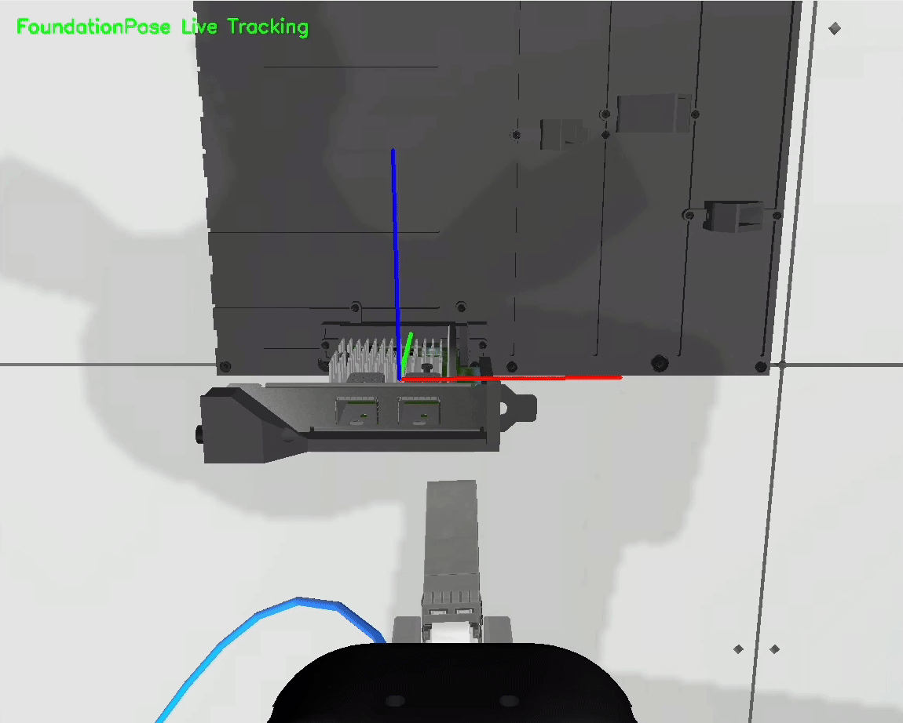
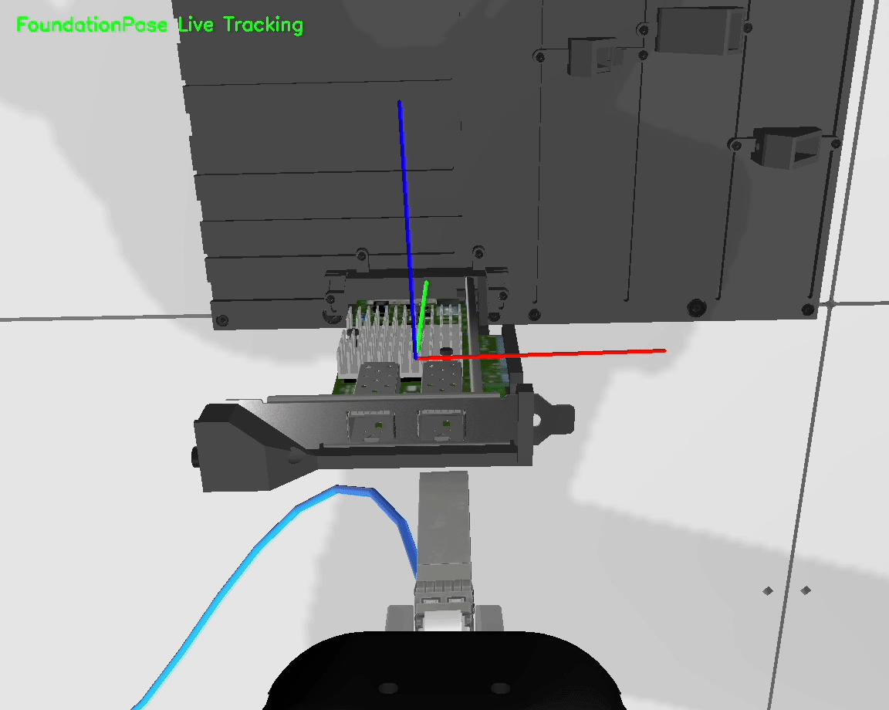

# Implementation of FoundationPose and SAM2 on AIC 

This repository contains an autonomous robotic insertion system developed based on the [**AI for Industry Challenge**](https://github.com/intrinsic-dev/aic) hosted by Intrinsic and Open Robotics.

The objective of this project is to perform the task of **dynamically tracking and inserting an SFP module into a network interface card (NIC) port** inside a simulated industrial workstation. The entire architecture is developed, tested, and executed on a cloud-based AWS EC2 instance.

 


## Architechture
This project is based on the aformentioned [AIC toolkit](https://github.com/intrinsic-dev/aic), in which the simulation environment, control pipeline and some example control strategies are provided. We modified the default Gazebo simulation environment to expose raw depth maps, allowing us to collapse the system down from three standard cameras to a **single Eye-in-Hand RGB-D sensor**.

1. **Raw image from Gazebo**

2. **Segmentation:** [Segment Anything 2 (SAM2)](https://github.com/facebookresearch/sam2.git) processes the RGB feed to generate a high-precision binary mask of the target card.

3. **6D Tracking:** [FoundationPose](https://github.com/NVlabs/FoundationPose.git) utilizes the RGB-D data and the SAM2 mask to predict the exact 6D object pose relative to the camera matrix.

4. **Control:** The system computes the coordinate transform chain (`base_link` → `camera` → `object_frame`) and calculates a static CAD offset to target the port. A Proportional-Integral (PI) velocity controller from the toolkit is used to minimize alignment errors to guide the arm to a successful insertion.



## Environment and setup

### Minimum Computation Specification by aic:
* **CPU: 4-8 cores**
* **RAM: 32GB+**
* **GPU: NVIDIA RTX 2070+ or equivalent**
* **VRAM: 8GB+**

### Host Specs of AWS EC2 g5.2xlarge:
* **CPU: 8 vCPUs**
* **RAM: 32GB**
* **GPU: NVIDIA A10G**
* **VRAM: 32GB**

### Setup
This project shares a similar environment setup with AIC toolkit, using [pixi](pixi.toml) to manage dependancies, and distrobox for simulation env, where gazebo is run.
The dependencies of SAM2 and FoundationPose are also added into [pixi dependencies](pixi.toml), but some inidividuale packages needed to be manually installed inside pixi environemnt. Intruction of setting up still under contruction.

## Technical Stack

* **Robotics Framework:** ROS 2 Kilted Kaiju
* **Simulation Engine:** Gazebo, Distrobox
* **Perception Frameworks:** Segment Anything 2 (SAM2), FoundationPose, OpenCV
* **Environment Management:** Pixi, pip

## Challanges
During close-proximity approach maneuvers, the image topic stream would intermittently drop entirely and turn completely gray.


Preliminary tests shows no sign of hardware resource starvation from CPU, memory or vRAM. Further tests are needed.

## Repo Structure

The core workflow and logic are contained within the following package structure:

```text
aic/
└── my_policy_node/my_policy_node   # Primary ROS 2 package
    ├── aic_model_depth.py          # Main ROS 2 executable node
    └── MyFoundationPosePolicy.py   # MyFoundationPosePolicy execution script
            
            
```

## License

This project is licensed under the Apache License 2.0 - see the individual package files for details.

